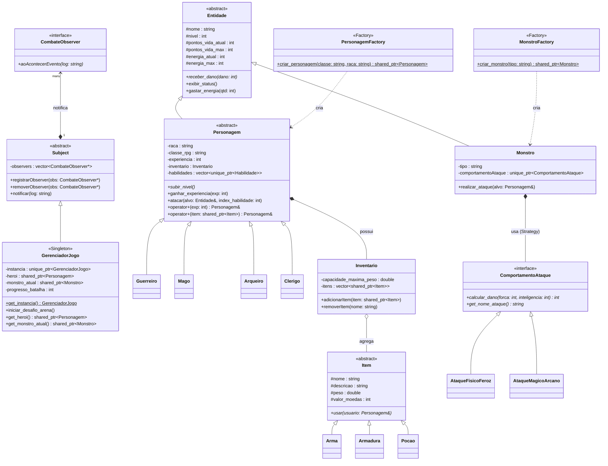

# Diagrama UML - RPG Manager

Abaixo está o diagrama de classes atualizado, refletindo as implementações de padrões de projeto (Observer, Strategy, Factory, Singleton) e a herança entre as entidades principais do sistema.

### Explicação do Diagrama
- **Padrão Strategy**: O `Monstro` utiliza a interface `ComportamentoAtaque` para delegar o cálculo de dano, permitindo variar os ataques em tempo de execução.
- **Padrão Observer**: `GerenciadorJogo` herda de `Subject` e emite notificações de eventos para qualquer `CombateObserver` registrado (neste caso, a interface gráfica).
- **Padrão Factory**: `MonstroFactory` e `PersonagemFactory` instanciam dinamicamente subclasses abstratas, encapsulando a complexidade de criação.
- **Padrão Singleton**: O `GerenciadorJogo` é unicamente instanciado no sistema via `get_instancia()`.
- **Composição de Inventário**: A classe `Personagem` contém instâncias de `Inventario` (Composição), o qual por sua vez agrega coleções de classes filhas de `Item` (Polimorfismo).
